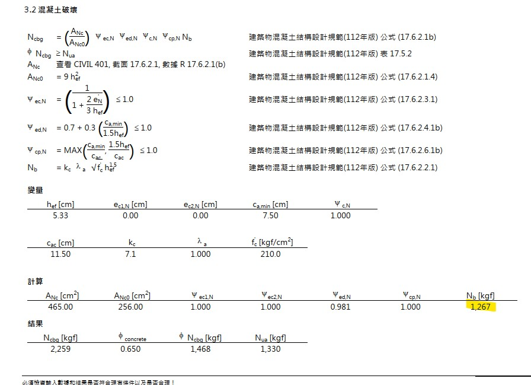

<meta charset="UTF-8">
<meta name="viewport" content="width=device-width, initial-scale=1.0">

<a href="./" class="back-btn">← 回到首頁</a>

# 🏗️ MOTW PROFIS ENGINEERING FAQ 

本技術庫整合了軟體操作、力學原理及最新規範。點擊下方分類快速查看。

---

## 📌 快速跳轉索引
* [🛠️ 軟體操作與功能設定](#軟體操作與功能設定)
* [⚖️ 法規、認證與標準](#法規認證相關)
* [📐 結構設計與力學分析](#結構設計與力學分析)
* [🏗️ 預埋槽 (Anchor Channel) 專區](#預埋系統)
* [⚡ 機械與化學錨栓選型考量](#機械化學比較)

---

##  🛠️ 軟體操作與功能設定

Q: 請問PROFIS Engineering要如何利用Excel輸入多重載重組合？

1. 先由結構軟體分析載重組合並複製。 
2. 在 PE 中點選「導入荷載」並貼上： 
 
3. 調整軸向與單位（拉力為正，壓力為負）： 
 
4. 點擊應用（一次最多支援 1000 種組合）： 
 

Q: 建好模型後如何更改檔名？

點選螢幕上方檔名旁邊的「設定圖示」即可重新編輯專案名稱： 

---

## ⚖️ 法規、認證與標準

  <h3 style="margin-top:0 !important; border:none !important; color:#D21F3C;">🌍 原始規範文件下載</h3>
  <ul style="margin-bottom:0; color:#555; padding-left:20px;">
    <li><a href="./土木401%20112.pdf" target="_blank">🇹🇼 台灣土木 401-112 (113/1/1 生效)</a></li>
    <li><a href="./ACI318%2019.pdf" target="_blank">🇺🇸 美國 ACI 318-19 規範</a></li>
    <li><a href="https://www.eota.eu/en-gb/content/eads/56/" target="_blank">🇪🇺 EOTA / EAD 歐洲技術評估準則 (EADs)</a></li>
  </ul>

Q: 113年1月1日生效的「建築物混凝土結構設計規範」有何重點？

新規範要求錨栓須考慮<b>開裂混凝土</b>及<b>地震載重 (Seismic Design)</b>。對於安全相關之附掛物，明確要求必須使用具有認證（如 ICC-ESR 或 ETA）的錨栓產品。

---

## 🏗️ 預埋槽 (Anchor Channel) 專區

Q: 預埋槽除了 Facade 以外還有哪些應用？

1. <b>電梯設備</b>：固定導軌與配重支架。 
2. <b>機電 MEP</b>：風管、水管與重型電纜橋架。 
3. <b>醫療設備</b>：手術室無影燈、設備滑軌固定。

---

## ⚡ 機械與化學錨栓：選型考量

Q: 機械錨栓 vs 化學錨栓的 Nb 值與設計原理差異？

在 PROFIS Engineering 設計中，選型的主要考量如下：
  
1. **破壞模式**：機械錨栓靠擴張應力擠壓孔壁；化學錨栓則靠藥劑與混凝土膠結。 
2. **Nb 值 (混凝土錐狀破壞)**：現場測試時，通常化學錨栓的抗拔力上限受限於鋼材強度，而機械錨栓則較早發生混凝土破壞。 
3. **地震區建議**：高地震區建議優先考慮具備 C2 認證的化學錨栓（如 HIT-RE 500 V3），其對於較寬的裂縫有更佳的位移耐受度。
 

Q: 如何手動輸入 1.5d 以下的邊距係數？

雖然 AISI S100 建議邊距不得小於 1.5d，但在 PE 軟體中，設計者可根據實際工程補強狀況，手動在參數欄位調整數值。若數值過低，軟體會顯示紅字警示，此時須檢核是否增加鋼板厚度或進行邊緣補強。

---

## 🧱 磚牆固定 (Masonry) 專區
*(此區塊內容可根據未來需求補充，已預留錨點 ID)*

Q: 如何在 PE 中選擇磚牆基材？

在軟體首頁將「基材」切換為 Masonry 模式，即可針對空心磚、實心磚進行設計檢核。

---

## 🙋‍♂️ 找不到答案？

  © 2026 Hilti Engineering Support Team | <b>MOTW 技術組</b> 維護

